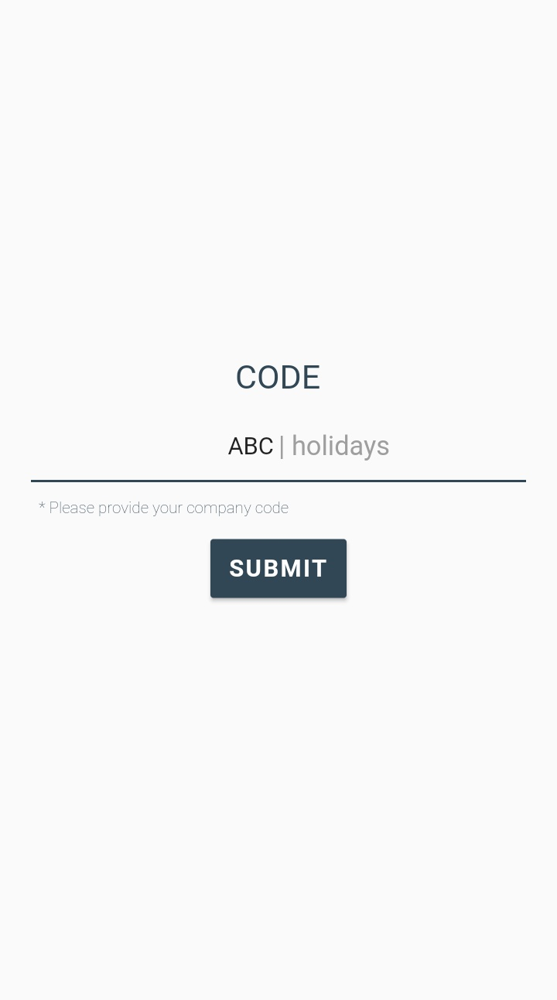
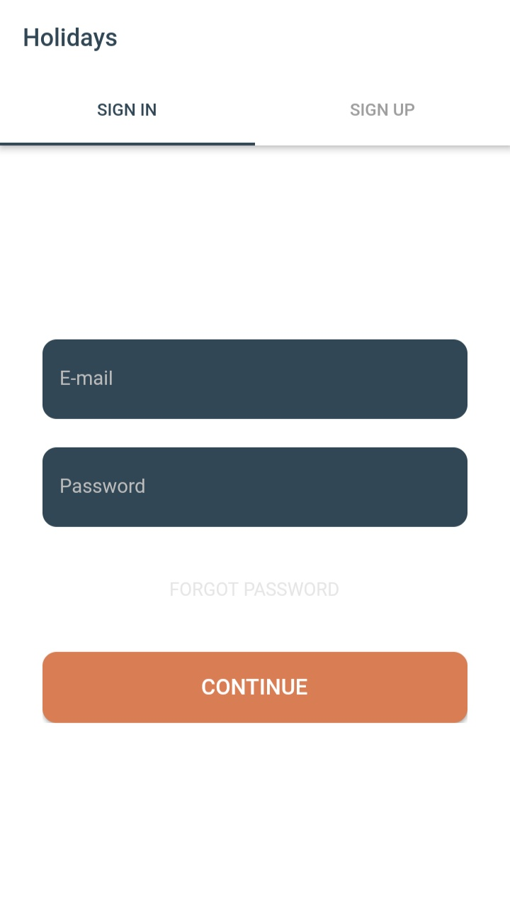
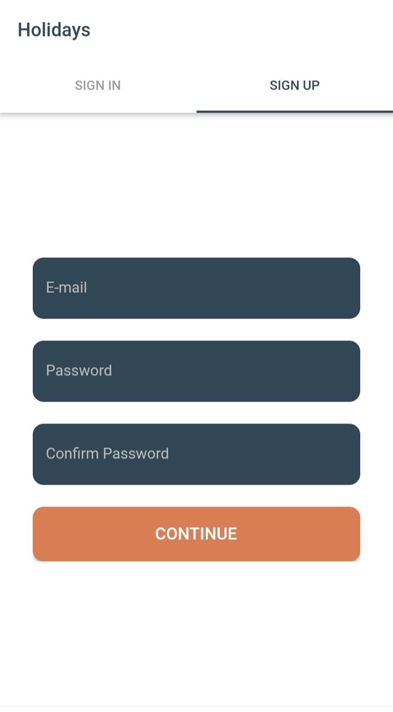

# Flutter Occassions

> A flutter application for displaying the list of the holidays throughout the year.

Main Features Used :
- Beautiful UI Design
- Form-Field Validation
- Firebase Authentication
- Firebase Database
- TabBar

## Screenshots

| 1 | 2|
|------|-------|
|||

| 3 | 4|
|------|-------|
|||

Don't forget to star :star2: the repo if you like our work.:heart::blue_heart::yellow_heart::purple_heart::green_heart:

## Website :link:

> [Toastguyz](www.toastguyz.com) - A programming tutorials website

## Support on social media :thumbsup:

>Follow us on our social media profiles to support us.

- [Youtube Channel](https://www.youtube.com/toastguyz)
- [Facebook Page](https://www.facebook.com/toastguyz)
- [Twitter Account](https://www.twitter.com/toastguyz)
- [Instagram Account](https://www.instagram.com/toastguyz)

## Code Developer

>### Jay Patel :fire:
>Enthusiastic Android & Flutter App Developer.

## ☕ Donate 

> [Paypal](https://www.paypal.me/toastguyz)

Thanks for reaching out to us. :100: 

# Getting Started

> 1. Create your flutter application project.
> 2. [Set up with firebase](https://firebase.google.com/docs)
> 3. Create Realtime Database with Test Rules and import the attached json file(flutter-ocassions.json) in Screenshots folder to your flutter project.
> 4. To run your project enable Authentication for email in [firebase console](https://console.firebase.google.com/).
> 5. After Running your app, use company code as "ABC" to move further.

    RealTime Database Rules : 
    {
        "rules": {
        ".read": true,
        ".write": true
        }
    }

Now, you're ready to rock the floor:guitar: